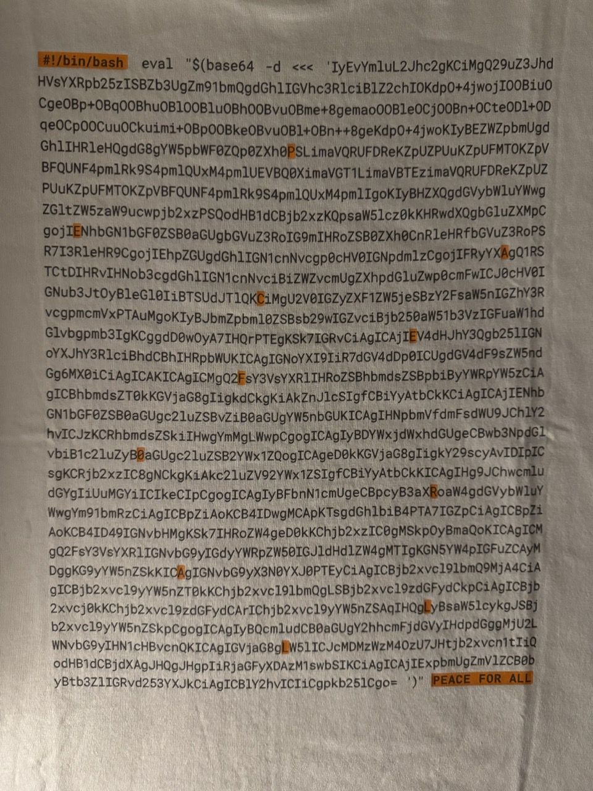

# Akamai PEACE FOR ALL t-shirt decoded

## How to use

Run either `akamai.sh` or `akamai-decoded.sh` to see the results.

```bash
./akamai.sh
```

```bash
./akamai-decoded.sh
```

## About
PEACE FOR ALL

“It’s time for action, in the name of world peace.” Major figures who share this vision with UNIQLO have volunteered to design T-shirts expressing their peaceful wishes. All proceeds will be donated to international organizations supporting those affected by violence, discrimination, armed conflict, and poverty. The Peace for All project is powered by each and every one of you who wears these T-shirts. Our wish is for a world in which all people can feel the peace of a future where everyone can live safely together. UNIQLO will continue to broaden this initiative, working with people all around the world.

Akamai Technologies

Cloud Company / Akamai Technologies, Inc., established in 1998, is the cybersecurity and cloud company that powers and protects life online. Leading companies worldwide choose Akamai to build, deliver, and secure their digital experiences — helping billions of people live, work, and play every day.

More than 25 years ago, Akamai helped make the internet we know today possible. This shirt’s design is a callback to those early days of life online. The light tan color is a reference to the “beige box” plastic casings that housed the early internet computers, and the heart on the front represents how the internet has been used for good all over the world. On the back of the T-shirt is real code. It’s a reference to Linux, the open source language of the internet. This common language unites Akamai with the world’s top brands and the people they serve, as we work together toward a vision of a safer and more connected world.


## T-shirt

> Product ID: 480814


Check it out at the Uniqlo store: [Uniqlo](https://www.uniqlo.com/us/en/products/E480814-000/00)
